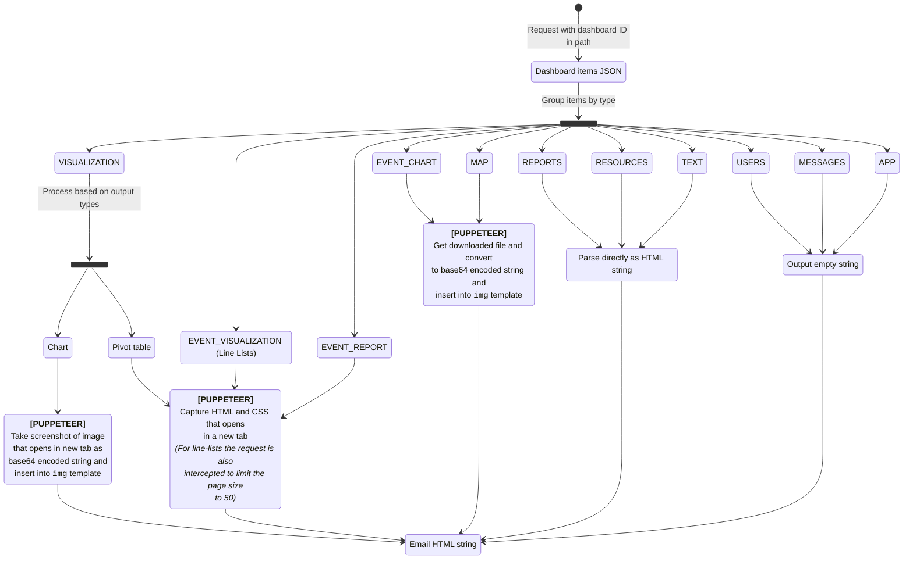

# Push Analytics

## Setting things up

### Environment variables

This app needs to establish an authenticated connection to a DHIS2 Core backend and relies on some environment variables to do so. If these variables are not found, then default values will be used and a message is logged to the console.

| ENV variable name          | Default value           | Description                                                             |
| -------------------------- | ----------------------- | ----------------------------------------------------------------------- |
| `HOST`                     | `localhost`             | Host name for the HTTP server                                           |
| `PORT`                     | `1337`                  | Port for the HTTP server                                                |
| `DHIS2_CORE_URL`           | `http://localhost:8080` | Host of the DHIS2 Core instance                                         |
| `DHIS2_CORE_MAJOR_VERSION` | `40`                    | API version to use when issuing API requests to the DHIS2 Core instance |
| `DHIS2_CORE_USERNAME`      | `admin`                 | DHIS2 Core username                                                     |
| `DHIS2_CORE_PASSWORD`      | `district`              | DHIS2 Core password                                                     |

In development mode this application uses [dotenv](https://github.com/motdotla/dotenv#readme) to load environment variables from a `.env` at the project root. This file is being gitignored, because it may contain sensitive information. Below is an example of a valid `.env` file which you can copy-paste into the project root:

```
HOST=localhost
PORT=1337
DHIS2_CORE_URL=http://localhost:8080
DHIS2_CORE_MAJOR_VERSION=40
DHIS2_CORE_USERNAME=admin
DHIS2_CORE_PASSWORD=district
```

### Installing dependencies

Run `yarn install`

### Using the application

To start the application in development run `yarn start:dev`. To try out dashboard-to-email conversion, issue a GET request to `host:port/dashboardId` (i.e. with default environment variable values, and using a dashboard ID from the Sierra Leone database, the following URL would be valid `http://localhost:1337/JW7RlN5xafN`)

## TODO

-   [x] Implement converter for all supported dashboard item types (this excludes `USERS`, `APP` and `MESSAGES`)
-   [x] Optimise email HTML template. We need support for horizontally scrolling tables
-   [x] Ensure items are displayed in the correct order
-   [x] Add link to dashboard in the email header
-   [ ] [BLOCKED] Convert text-based element selection to DOM attribute based element selection. _Currently there is no way to uniquely identify the download dropdown-button or the download-menu-items based on DOM attributes, so to implement this we would need to add unique selectors to all apps. **This is currently blocking producing localized content.**_
-   [ ] [Maybe] Restructure folders so all converters are in one place
-   [ ] Present initial implementation as a PR
-   [ ] Discuss and implement a way for core instances to use this application. Currently it is implemented as a stand-alone service but this could easily be just a NodeJS script called by the DHIS2 Core instance.
-   [ ] Add tests. Since the conversion from dashboard to email HTML is fully linear, the simplest way to add a good level of test coverage would be to simply see if for a given dashboard we produce the same HTML output. In the long term it would be advisable to run this test on a daily basis and send a Slack notification once it starts failing. This app will break if things change too much in the web API or in one of the apps that Puppeteer visits. We can also consider adding unit tests for each individual function, but IMO that's probably not required because testing if a known input produces the correct output implicitly tests the underlying functions too.

## How things work

The flowchart below describes the inner working of the dashboard-to-email-html process in detail and the following general principles have been used:

1. A lot of our visualizations are produced client-side and we don't want to have a client-side and server-side implementation of each visualization. So we use a headless browser which visits DHIS2 apps to avoid this duplication.
1. An app is interactive and an email is not. As a result just taking a screenshot from an app does not always produce useable output. A downloaded file is static, so output produced by an app's export/download functionality should be fairly suitable to insert into an email. So we directly use the apps' file download capabilities instead of taking screenshots.
1. Some dashboard item types are rendered directly in the dashboards-app itself and are very simple. These types are parsed directly by push-analytics as well. So for these types we run the theoretical risk of the implementations going out-of-sync. It would be possible to extract the HTML from the dashboard-app itself, but this would impact, but the current implementation favours parsing it directly, because this requires very little code and has a much smaller execution time.
1. Even though the codebase contains many async function calls, everything is being executed sequentially. The reason for this is mainly related to how a headless browsers works. It is technically possible to let things happen at once by using `Promise.all()`, but this does not always work as expected. One example is the maps-app: if the tab becomes inactive, the map stops rendering the layers and it won't continue until the tab becomes active again, and since a browser can only have one active tab, wrapping things in `Promise.all()` makes the map conversion fails. Perhaps it is possible to optimise performance by letting some things happen sequentially and other things in parallel, but this would also make the codebase harder to maintain due to increased complexity. So at least for now everything happens sequentially.
1. When processing things sequentially, we first group items by type and then convert items one type at a time. The thinking behind this is that, when visiting an app, the initial load takes quite some time, but loading a new item within an app takes a shorter time. By processing items per type we ensure that the initial loading time will only be experienced by the first item of that type. After that first item, the client will not reload fully, it will simply navigate to a new ID and fetch whatever that visualization requires.
1. The Puppeteer code looks quite a lot like e2e-test code, but there is one notable difference: when writing e2e tests it is recommended to get elements by text content if possible. But since it should be possible to pass different user credentials to produce emails in different locales, we should **never** select any element by text.

### Conversion flowchart



## Producing localized email content

The below is just a small summary of how things _could theoretically_ work. Both options assume that a localised version of the dashboard exists:

**Option A:**

1. Create a different user for each locale
1. Ensure that user has access to the dashboard, and underlying apps
1. When converting the dashboard to HTML, ensure to pass the user credentials for the appropriate locale

**Option B:**

1. Create a single user that has access to the dashboard and underlying apps
2. Before starting the conversion, set the locale of that user to the target locale
3. Pass the same credentials all the time
