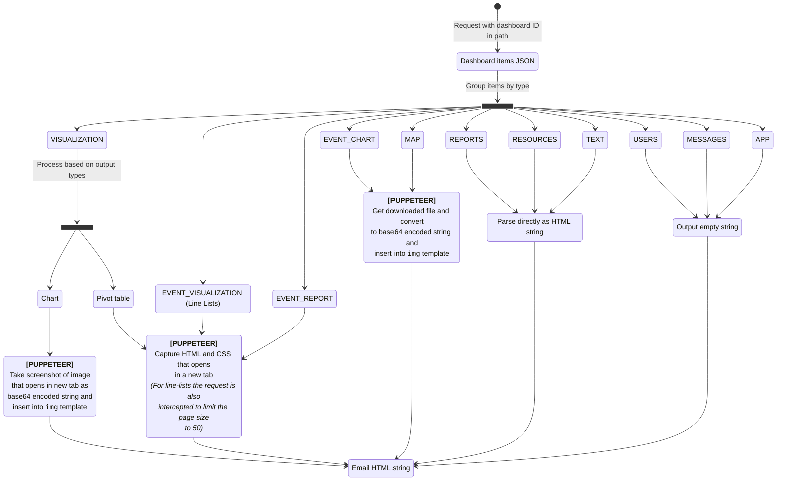

# Push Analytics

## Setup instructions

### Prerequisites for the Push Analytics Service

NodeJS with a min version `20.11.0` (LTS at the time of writing). Lower version may also suffice, as far as I am aware, the most modern API feature used by the push-analytics-service is [os.availableParallelism()](https://nodejs.org/api/os.html#osavailableparallelism).

### Prerequisites for the DHIS2 Core Instance

-   DHIS2 Core needs to be version 41 or above to have the push-analytics job-type available in the job-scheduler. Some analytics-apps also need to be installed and have to be above a certain version, but all apps bundled have with 2.41 will have meet this requirement:
    -   Data Visualizer App `##.##.##` (core app)
    -   Maps App `##.##.##` (core app)
    -   Event Charts App `##.##.##` (core app)
    -   Event Reports App `##.##.##` (core app)
    -   Line Listing App `##.##.##`. This app can be installed from the app hub and is only required if the instance has line lists on dashboards.
-   The DHIS2 Core Instance needs to have a valid email configuration. Instructions on how to achieve this is out-of-scope for this document.
-   The instance needs to be configured to allow [user-impersonation](https://docs.dhis2.org/en/manage/performing-system-administration/dhis-core-version-master/debugging-as-another-user.html?h=user+impersonation+master#user_impersonation), which requires some changes to the `dhis.conf` file:
    -   `switch_user_feature.enabled = true`
    -   `switch_user_allow_listed_ips = <PUSH_ANALYTICS_SERVICE_IP>`
-   The URL/IP of the push analytics service needs to be added to the CORS whitelist of the DHIS2 Core Instance
-   A "User impersonator" role needs to be added which gets granted the `IMPERSONATE_USER` authority
-   A user account needs to be created which gets assigned to this role. The username and password for this user then need to be provided as the `DHIS2_CORE_USERNAME` and `DHIS2_CORE_PASSWORD` environment variables for the push analytics service.

### Environment variables

The push analytics service needs to establish an authenticated connection to a DHIS2 Core backend and relies on some environment variables to do so. If these variables are not found, then default values will be used and a message is logged to the console.

| ENV variable name            | Default value           | Description                                                                                                                                                                                                                                              |
| ---------------------------- | ----------------------- | -------------------------------------------------------------------------------------------------------------------------------------------------------------------------------------------------------------------------------------------------------- |
| `HOST`                       | `localhost`             | Host name for the HTTP server                                                                                                                                                                                                                            |
| `PORT`                       | `1337`                  | Port for the HTTP server                                                                                                                                                                                                                                 |
| `DHIS2_CORE_URL`             | `http://localhost:8080` | Host of the DHIS2 Core instance                                                                                                                                                                                                                          |
| `DHIS2_CORE_MAJOR_VERSION`   | `40`                    | API version to use when issuing API requests to the DHIS2 Core instance                                                                                                                                                                                  |
| `DHIS2_CORE_USERNAME`        | `admin`                 | DHIS2 Core username                                                                                                                                                                                                                                      |
| `DHIS2_CORE_PASSWORD`        | `district`              | DHIS2 Core password                                                                                                                                                                                                                                      |
| `MAX_THREADS`                | `4`                     | Max number of threads (worker nodes) to use. If set to "max", all available threads will be used. If a number is provided this will be used (capped by number of available threads). If this variable is not set, 50% of available threads will be used. |
| `DHIS2_CORE_SESSION_TIMEOUT` | `3600`                  | Session expiry on the DHIS2 Core instance. Ensure that this value matches the actual session expiry timeout on the core instance to prevent authentication issues in the push analytics service.                                                         |

In development mode this application uses [dotenv](https://github.com/motdotla/dotenv#readme) to load environment variables from a `.env` file at the project root. This file is being gitignored, because it may contain sensitive information. The `.env.template` file, can be used to get started.

### Installing dependencies

Run `yarn install`

### Starting the push-analytics-service

To start the service in development mode, run `yarn start:dev`, for production, run `yarn start`. We are also planning on adding a `Dockerfile` and `docker-compose.yml` which will enable developers to get a working development setup up-and-running without too much effort.

### Requesting a dashboard

The push-analytics-service currently only converts dashboards to static HTML and its API is very simple: we only support a GET request in the following form: `host:port/?dashboardId=<DASHBOARD_ID>&username=<USERNAME>` (i.e. with default environment variable values, and using a dashboard ID from the Sierra Leone database, the following URL would be valid `http://localhost:1337/?dashboardId=WSogaXf2eMq&username=test_user`).

#### About the `username` query parameter

This user account will be **impersonated** by the push-analytics-service. The static HTML returned by the push-analytics service will contain the same content and be in the same locale as if this user account visited the provided dashboard in the dashboards-app. As such this parameter can be used to produce localised and personalised content (e.g. dashboards with organisation unit specific data). There are a few things to keep in mind however:

-   When issuing a GET request and providing the `username` with elevated privileges and then distributing this content to users (a user-group) with lower privileges could cause a problem in the sense that these users may be seeing content they are normally not allowed to see. This is something to keep in mind when creating push-analytics-jobs in the DHIS2 Core instance, since the push-analytics-service is blissfully unaware of user authorities in DHIS2 Core.
-   Users with the `ALL` authority cannot be impersonated, so all GET request which specify a `username` param for a user account with the `ALL` authority will fail.

## How things work (NO LONGER CORRECT - NEEDS UPDATE)

The flowchart below describes the inner working of the dashboard-to-email-html process in detail and the following general principles have been used:

1. A lot of our visualizations are produced client-side and we don't want to have a client-side and server-side implementation of each visualization. So we use a headless browser which visits DHIS2 apps to avoid this duplication.
1. An app is interactive and an email is not. As a result just taking a screenshot from an app does not always produce useable output. A downloaded file is static, so output produced by an app's export/download functionality should be fairly suitable to insert into an email. So we directly use the apps' file download capabilities instead of taking screenshots.
1. Some dashboard item types are rendered directly in the dashboards-app itself and are very simple. These types are parsed directly by push-analytics as well. So for these types we run the theoretical risk of the implementations going out-of-sync. It would be possible to extract the HTML from the dashboard-app itself, but this would impact, but the current implementation favours parsing it directly, because this requires very little code and has a much smaller execution time.
1. Even though the codebase contains many async function calls, everything is being executed sequentially. The reason for this is mainly related to how a headless browsers works. It is technically possible to let things happen at once by using `Promise.all()`, but this does not always work as expected. One example is the maps-app: if the tab becomes inactive, the map stops rendering the layers and it won't continue until the tab becomes active again, and since a browser can only have one active tab, wrapping things in `Promise.all()` makes the map conversion fails. Perhaps it is possible to optimise performance by letting some things happen sequentially and other things in parallel, but this would also make the codebase harder to maintain due to increased complexity. So at least for now everything happens sequentially.
1. When processing things sequentially, we first group items by type and then convert items one type at a time. The thinking behind this is that, when visiting an app, the initial load takes quite some time, but loading a new item within an app takes a shorter time. By processing items per type we ensure that the initial loading time will only be experienced by the first item of that type. After that first item, the client will not reload fully, it will simply navigate to a new ID and fetch whatever that visualization requires.
1. The Puppeteer code looks quite a lot like e2e-test code, but there is one notable difference: when writing e2e tests it is recommended to get elements by text content if possible. But since it should be possible to pass different user credentials to produce emails in different locales, we should **never** select any element by text.

### Conversion flowchart (NO LONGER CORRECT - NEEDS UPDATE)

## Errors

The push-analytics-service codebase contains various error classes which all extend the base `PushAnalyticsError`, which itself extends the native JavaScript `Error` class. Errors extending from `PushAnalyticsError` have some properties and methods of interest:

-   `httpStatusCode`: This status code is used when sending the response
-   `errorCode`: These codes are specific to the push analytics service. Currently they are not utilized but in the long term these codes could be used by API consumers to take specific actions or show particular messages. See an overview of current errors below, and note the following:
    -   The `errorCode` is a string starting with and `E` followed by 4 digits, i.e. `E1000`
    -   Primary process errors are all in the 1000 range, and worker errors are all in the 2000 range
    -   Currently, each class in push-analytics throws its own error with its own error code and no further granularity has been applied.
-   `formattedMessage()`: This method will return a formatted string which includes the error name, code and message.

| Error code | HTTPS Status Code | Error Class (name)                  | Description                                           |
| ---------- | ----------------- | ----------------------------------- | ----------------------------------------------------- |
| `E1101`    | `500`             | `PrimaryProcessError`               | Generic error in `PrimaryProcess` class               |
| `E1102`    | `500`             | `PrimaryProcessError`               | Worker crashed                                        |
| `E1103`    | `504`             | `PrimaryProcessError`               | Conversion process timed out timed out                |
| `E1201`    | `500`             | `DashboardItemsQueueError`          | Generic error in `DashboardItemsQueue` class          |
| `E1301`    | `500`             | `HtmlCollectorError`                | Generic error in `HtmlCollector` class                |
| `E1401`    | `500`             | `PrimaryProcessMessageHandlerError` | Generic error in `PrimaryProcessMessageHandler` class |
| `E1501`    | `500`             | `RequestHandlerError`               | Generic error in `RequestHandler` class               |
| `E1502`    | `400`             | `RequestHandlerError`               | Invalid query parameters in request                   |
| `E1503`    | `404`             | `RequestHandlerError`               | Invalid pathname in request                           |
| `E1504`    | `405`             | `RequestHandlerError`               | Invalid request method                                |
| `E1505`    | `400`             | `RequestHandlerError`               | Invalid request headers                               |
| `E1601`    | `500`             | `ResponseManagerError`              | Generic error in `ResponseManager` class              |
| `E2101`    | `500`             | `WorkerProcessError`                | Generic error in `WorkerProcess` class                |
| `E2201`    | `500`             | `AppScraperError`                   | Generic error in `AppScraper` class                   |
| `E2301`    | `500`             | `AuthenticatorError`                | Generic error in `Authenticator` class                |
| `E2401`    | `500`             | `DashboardItemConverterError`       | Generic error in `DashboardItemConverter` class       |
| `E2501`    | `500`             | `ItemParserError`                   | Generic error in `ItemParser` class                   |
| `E2601`    | `500`             | `ScrapeConfigCacheError`            | Generic error in `ScrapeConfigCache` class            |
| `E2701`    | `500`             | `WorkerProcessMessageHandlerError`  | Generic error in `WorkerProcessMessageHandler` class  |

## TODO (To be removed before release)

-   [x] Convert text-based element selection to DOM attribute based element selection. _Currently there is no way to uniquely identify the download dropdown-button or the download-menu-items based on DOM attributes, so to implement this we would need to add unique selectors to all apps. **This is currently blocking producing localized content.**_
-   [ ] Discuss and implement a way for core instances to use this application. Currently it is implemented as a stand-alone service but this could easily be just a NodeJS script called by the DHIS2 Core instance.
-   [ ] Add tests. Since the conversion from dashboard to email HTML is fully linear, the simplest way to add a good level of test coverage would be to simply see if for a given dashboard we produce the same HTML output. In the long term it would be advisable to run this test on a daily basis and send a Slack notification once it starts failing. This app will break if things change too much in the web API or in one of the apps that Puppeteer visits. We can also consider adding unit tests for each individual function, but IMO that's probably not required because testing if a known input produces the correct output implicitly tests the underlying functions too.
-   [ ] Handle concurrent requests
-   [x] Ensure file downloading doesn't hang (max tries)
-   [x] Always clear files
-   [ ] Return error if >= 1 dashboard-items fail. Otherwise return HTML string
-   [ ] Only allow request from localhost or from DHIS2_CORE_URL
-   [ ] Ensure requests are queued until all workers have logged in successfully
-   [ ] Ensure main worker does not crash but returns errors when stuff goes wrong
-   [ ] Update docs/readme
-   [ ] Ensure items are sorted correctly
-   [ ] Eliminate the need for a request-queue: it should be possible to add items to the dashboard-item queue across requests
-   [ ] Error monitoring / restarting when shuts down
