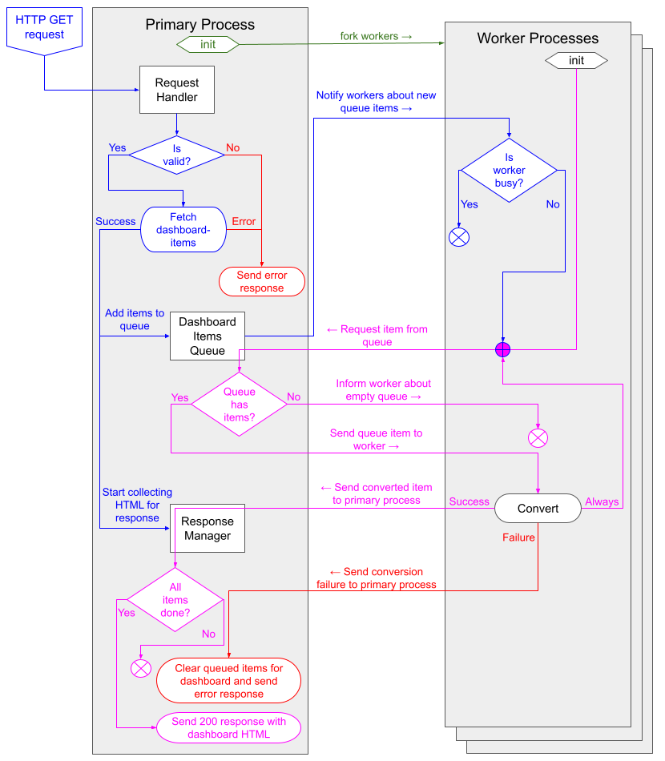

# Push Analytics

A service to convert DHIS2 Core Dashboards into static HTML, which can be sent by email. This service is intended to be used in conjunction with the DHIS2 Core Job Scheduler, where a job can be configured to email converted dashboard content to user-groups.

## Setup instructions

### Prerequisites for the Push Analytics Service

-   NodeJS with a min version `20.11.0` (LTS at the time of writing). Lower version may also suffice, as far as I am aware, the most modern API feature used by the Push Analytics Service is [os.availableParallelism()](https://nodejs.org/api/os.html#osavailableparallelism).
-   Push Analytics uses [Puppeteer](https://pptr.dev/), which is _"a Node.js library which provides a high-level API to control Chrome/Chromium over the DevTools Protocol"_. When installing Puppeteer, a version of the Chrome browser is installed along with it, but the system does need to have a few tools installed in order for Chrome to work. Please refer to the [Puppeteer Docker file](https://github.com/puppeteer/puppeteer/blob/main/docker/Dockerfile) to see which libs are needed.

### Prerequisites for the DHIS2 Core Instance

-   DHIS2 Core needs to be version 41.1 or above to have the Push Analytics job-type available in the job-scheduler. Some analytics-apps also need to be installed and have to be above a certain version, but all apps bundled have with 2.41.1 will have meet this requirement:
    -   Data Visualizer App `100.6.1` (core app)
    -   Maps App `100.6.2` (core app)
    -   Event Visualizer App `33.1.1` (core app)
    -   Event Reports App `33.2.68` (core app)
    -   Line Listing App `101.1.0`. This app can be installed from the app hub and is only required if the instance has line lists on dashboards.
-   The DHIS2 Core Instance needs to have a valid email configuration. Instructions on how to achieve this is out-of-scope for this document.
-   The instance needs to be configured to allow [user-impersonation](https://docs.dhis2.org/en/manage/performing-system-administration/dhis-core-version-master/debugging-as-another-user.html?h=user+impersonation+master#user_impersonation), which requires some changes to the `dhis.conf` file:
    -   `switch_user_feature.enabled = true`
    -   `switch_user_allow_listed_ips = <PUSH_ANALYTICS_SERVICE_IP>`
    -   `max.sessions.per_user = 100` (not required for user impersonation, but the default value of 10 could be problematic when different chrome instances are impersonating different users)
-   The URL/IP of the push analytics service needs to be added to the CORS whitelist of the DHIS2 Core Instance
-   A "User impersonator" role needs to be added which gets granted the following authorities:
    -   `IMPERSONATE_USER` so it can impersonate different users to produce different conversions of the same dashboard
    -   `F_VIEW_EVENT_ANALYTICS` is also needed to ensure all dashboards can be fetched and viewed
    -   Authorities to all apps that may be present on a dashboard, the dashboards-app and the login-app:
        -   `M_dhis-web-event-visualizer`
        -   `M_dhis-web-event-reports`
        -   `M_dhis-web-login`
        -   `M_dhis-web-data-visualizer`
        -   `M_linelisting`
        -   `M_dhis-web-dashboard`
        -   `M_dhis-web-maps`
-   A user account needs to be created which gets assigned to this role. The username and password for this user then need to be provided as the `DHIS2_CORE_USERNAME` and `DHIS2_CORE_PASSWORD` environment variables for the push analytics service.

### Environment variables

The push analytics service needs to establish an authenticated connection to a DHIS2 Core backend and relies on some environment variables to do so. If these variables are not found, then default values will be used and a message is logged to the console.

| ENV variable name            | Default value           | Description                                                                                                                                                                                                                                              |
| ---------------------------- | ----------------------- | -------------------------------------------------------------------------------------------------------------------------------------------------------------------------------------------------------------------------------------------------------- |
| `HOST`                       | `localhost`             | Host name for the HTTP server                                                                                                                                                                                                                            |
| `PORT`                       | `1337`                  | Port for the HTTP server                                                                                                                                                                                                                                 |
| `DHIS2_CORE_URL`             | `http://localhost:8080` | Host of the DHIS2 Core instance                                                                                                                                                                                                                          |
| `DHIS2_CORE_MAJOR_VERSION`   | `40`                    | API version to use when issuing API requests to the DHIS2 Core instance                                                                                                                                                                                  |
| `DHIS2_CORE_ADMIN_USERNAME`  | `admin`                 | DHIS2 Core username                                                                                                                                                                                                                                      |
| `DHIS2_CORE_ADMIN_PASSWORD`  | `district`              | DHIS2 Core password                                                                                                                                                                                                                                      |
| `DHIS2_CORE_SESSION_TIMEOUT` | `3600`                  | Session expiry on the DHIS2 Core instance. Ensure that this value matches the actual session expiry timeout on the core instance to prevent authentication issues in the push analytics service.                                                         |
| `MAX_THREADS`                | `4`                     | Max number of threads (worker nodes) to use. If set to "max", all available threads will be used. If a number is provided this will be used (capped by number of available threads). If this variable is not set, 50% of available threads will be used. |
| `NODE_ENV`                   | `production`            | Environment context, can be one of the following values `development`, `production`, `ci` or `testing`                                                                                                                                                   |
| `LOG_LEVEL`                  | `off`                   | Can be `off`,`on`, or `verbose` (see [logging section](#logging) for details)                                                                                                                                                                            |

In development mode this application uses [dotenv](https://github.com/motdotla/dotenv#readme) to load environment variables from a `.env` file at the project root. This file is being gitignored, because it may contain sensitive information. The `.env.template` file, can be used to get started.

### Installing dependencies

Run `npm install`

### Starting the Push Analytics Service

To start the service in development mode, run `npm run start:dev`. Development mode uses `nodemon` to watch file changes and will restart the app whenever a file has been updated. This is very convenient during development, but it should be noted that nodemon sometimes (especially when saving frequently) fails to kill the worker threads and this can cause memory issues on the host machine. It is recommended to keep and eye on this periodically kill these stray processes.

To start the service in production mode, run `npm run start:prod`. In this mode the app is first built and then compiled JS files are served, so file changes will be ignored. The same environment variables are used as in development mode.

### Docker

The amount of prerequisites that need to be fulfilled to successfully run Push Analytics make it quite complex to set up. To make things a bit easier, a few docker based solutions are included.

#### Docker image

The `Dockerfile` is based on Alpine Linux with various packages installed to run NodeJS and headless Chrome with WebGL support. It also contains the production dependencies and the production version of the Push Analytics Service (Typescript compiled to JavaScript). This image is primarily meant to be installed on a production server, but can also be used for demos etc.

Whenever a new version is released, a new Docker image is automatically generated and uploaded to the Docker Hub. The image on Docker Hub supports both the `linux/amd64` and `linux/arm64` (Apple Silicon) architecture.

Creating a local image with the tag `dhis2/push-analytics:local` is also supported by issuing the command `npm run build:docker:local`. This local image is being used when the e2e tests run on CI and can be used in a local development machine too.

#### Docker compose stack

A `docker-compose.yml` is included with the following services:

-   `web`: The DHIS2 Core Instance, with a configurable image tag
-   `db`: The PostGIS server for DHIS2 Core
-   `db-dump`: An "init container" responsible for populating the database
-   `post-install-scripts`: Another "init container" that installs the line-listing-app and generates analytics tables
-   `fake-smtp-server`: DHIS2 Core can be configured to use this as its email service and there is a web UI to inspect the emails that have been sent by the DHIS2 Core Job Scheduler.
-   `push-analytics`: The Push Analytics Service itself, with a configurable image tag
-   `e2e`: A NodeJS service that runs the e2e test suite.

The `docker` folder contains a custom `dhis2.conf` that enables user impersonation and increases the number of allowed user sessions, and a DB Dump for a database that fulfills all preconditions has been uploaded to the Push Analytics repo and will be used to create the DHIS2 Core service. Details of what has been added to the database are [documented here](docker/DB.md)

Note that, by default, `docker compose` will look for a file called `.env` to source its environment variables, however, the `.env` file in the Push Analytics repo serves a different purpose ([as explained here](#environment-variables)). Instead, the `.env.e2e` file is meant to be used for docker compose, and as a result all docker compose commands will need to specify which environment file to use, i.e. `docker compose --env-file ./.env.e2e up [..]`.

Also not that the `e2e` service **cannot** be initialized in the same command as the other services, because it will start running too soon and all tests will fail. This behavior could be easily addressed by making the `e2e` service depend on the `push-analytics` service's initialization. But by introducing this dependency chain we would also cause the `post-install-scripts` to start running again whenever the `e2e` service is restarted. This proved to be very impractical during development because `post-install-scripts` will start generating analytics tables again, effectively blocking the whole stack until completed. As such it is recommended to always explicitly provide a list of services in the `docker compose up` command, and only to spin up the `e2e` service by itself.

Depending on the context various services in docker compose stack can be used in different ways. Some convenience commands for more common scenarios, like the ones listed below, have been added to the `scripts` section of `package.json`:

-   **Local development**: Running `npm run docker:compose:dev` will spin up a specially prepared DHIS2 Core instance with line-listing and populated analytics tables. Once everything is done, the process is terminated and the `npm run start:dev` command can be issued to start Push Analytics in dev mode. For development it is easiest to interact with the API directly and not via the Job Scheduler. As such no emails will be sent and therefore the `fake-smtp-server` is not included the `npm run docker:compose:dev` command.
-   **Demo**: To create a demo environment run `npm run docker:compose:demo`. This will spin up all services in the docker compose file apart from `e2e`. To ensure stability, for Push Analytics itself, a docker image of the latest stable released version is pulled rather than using the local docker image.

Using `docker compose` directly in combination with the `start:*` or `test:*` scripts allows a lot of flexibility and should cater for all sorts of development/debugging/demo scenarios. For example, suppose there is an issue on CI with the E2E test suite and you would like to replicate this locally:

1. Build a local docker image of the current codebase: `npm run docker:build:local`
2. Spin up the relevant services (incl. Push Analytics itself): `docker compose --env-file ./.env.e2e up -d web db db-dump post-install-scripts push-analytics`
3. Spin up the `e2e` service: `docker compose --env-file ./.env.e2e up e2e`

## API

### Requesting a dashboard

The Push Analytics Service currently only converts dashboards to static HTML and its API is very simple: we only support a GET request in the following form:

```
host:port/?dashboardId=<DASHBOARD_ID>&username=<USERNAME>&locale=<LOCALE>
```

All query parameters are required, but if the `locale` parameter is empty it will default to `en`. This is to cater for an edge case where a DHIS2 Core user account does not have `dbLocale` and the system default `dbLocale` has not been set either. With default environment variable values, and using a dashboard ID from the Sierra Leone database, the following URL would be valid:

```
http://localhost:1337/?dashboardId=WSogaXf2eMq&username=test_user&locale=en
```

#### About the `username` query parameter

This user account will be **impersonated** by the Push Analytics Service. The static HTML returned by the Push Analytics Service will contain the same content and be in the same locale as if this user account visited the provided dashboard in the dashboards-app. As such this parameter can be used to produce localised and personalised content (e.g. dashboards with organisation unit specific data). There are a few things to keep in mind however:

-   When issuing a GET request and providing the `username` with elevated privileges and then distributing this content to users (a user-group) with lower privileges could cause a problem in the sense that these users may be seeing content they are normally not allowed to see. This is something to keep in mind when creating push analytics jobs in the DHIS2 Core instance, since the Push Analytics Service is blissfully unaware of user authorities in DHIS2 Core.
-   Users with the `ALL` authority cannot be impersonated, so all GET request which specify a `username` param for a user account with the `ALL` authority will fail.
-   A dashboard can only be successfully converted if it is fully accessible/visible to the user account that is provided in the `username` query parameter.

### Errors

The Push Analytics Service codebase contains various error classes which all extend the base `PushAnalyticsError`, which itself extends the native JavaScript `Error` class. Errors extending from `PushAnalyticsError` have some properties and methods of interest:

-   `httpStatusCode`: This status code is used when sending the error response
-   `errorCode`: These codes are specific to the push analytics service. Currently they are not utilized but in the long term these codes could be used by API consumers to take specific actions or show particular messages. See an overview of current errors below, and note the following:
    -   The `errorCode` is a string starting with and `E` followed by 4 digits, i.e. `E1000`
    -   Primary process errors are all in the 1000 range, and worker errors are all in the 2000 range
-   `formattedMessage()`: This method will return a formatted string which includes the error name, code and message.

| Error code | HTTPS Status Code | Error Class (name)                  | Description                                           |
| ---------- | ----------------- | ----------------------------------- | ----------------------------------------------------- |
| `E1101`    | `500`             | `PrimaryProcessError`               | Generic error in `PrimaryProcess` class               |
| `E1102`    | `500`             | `PrimaryProcessError`               | Worker crashed                                        |
| `E1103`    | `504`             | `PrimaryProcessError`               | Conversion process timed out timed out                |
| `E1201`    | `500`             | `DashboardItemsQueueError`          | Generic error in `DashboardItemsQueue` class          |
| `E1301`    | `500`             | `HtmlCollectorError`                | Generic error in `HtmlCollector` class                |
| `E1401`    | `500`             | `PrimaryProcessMessageHandlerError` | Generic error in `PrimaryProcessMessageHandler` class |
| `E1501`    | `500`             | `RequestHandlerError`               | Generic error in `RequestHandler` class               |
| `E1502`    | `400`             | `RequestHandlerError`               | Invalid query parameters in request                   |
| `E1503`    | `404`             | `RequestHandlerError`               | Invalid pathname in request                           |
| `E1504`    | `405`             | `RequestHandlerError`               | Invalid request method                                |
| `E1505`    | `400`             | `RequestHandlerError`               | Invalid request headers                               |
| `E1505`    | `403`             | `RequestHandlerError`               | Remote IP not allowed                                 |
| `E1601`    | `500`             | `ResponseManagerError`              | Generic error in `ResponseManager` class              |
| `E2101`    | `500`             | `WorkerProcessError`                | Generic error in `WorkerProcess` class                |
| `E2201`    | `500`             | `AppScraperError`                   | Generic error in `AppScraper` class                   |
| `E2301`    | `500`             | `AuthenticatorError`                | Generic error in `Authenticator` class                |
| `E2401`    | `500`             | `DashboardItemConverterError`       | Generic error in `DashboardItemConverter` class       |
| `E2501`    | `500`             | `ItemParserError`                   | Generic error in `ItemParser` class                   |
| `E2601`    | `500`             | `ScrapeConfigCacheError`            | Generic error in `ScrapeConfigCache` class            |
| `E2701`    | `500`             | `WorkerProcessMessageHandlerError`  | Generic error in `WorkerProcessMessageHandler` class  |

## Logging

Push Analytics comes with a very basic logging utility. It prefixes each log message with a color code string to indicate the type of process (primary VS worker) and process PID. The amount of output is controlled by the `LOG_LEVEL` environment variable:

-   `LOG_LEVEL=off` (or omitting the `LOG_LEVEL` variable completely) disables log output completely
-   `LOG_LEVEL=on` enables all log statements, but functions and objects will not be printed to the console
-   `LOG_LEVEL=verbose` enables all log statements, and functions and objects will also be printed to the console

## Architecture

### Guiding principles

1. Visualizations in DHIS2 Core are produced client-side and the job scheduler is a server side feature. To supply the job scheduler with the correct HTML could be done by also implementing all available visualizations server side, but maintaining both a client-side and server-side implementation for each and ensuring the output is consistent is error prone and represents a huge maintenance burden. So, instead we use a headless browser which "scrapes" DHIS2 apps to avoid this duplication.
1. An app is interactive and an email is not. As a result just taking a screenshot from an app does not always produce the desired output. A downloaded file is static, so output produced by an app's export/download functionality should be fairly suitable to insert into an email. So we prefer to directly use the apps' file download capabilities instead of taking screenshots. For cases where there is no download artifact, we do support scraping content or taking screenshots directly from the app.
1. Some dashboard item types are rendered directly in the dashboards-app itself and do not have a corresponding app. These types are parsed directly by Push Analytics as well. So for these types we run the theoretical risk of the implementations going out-of-sync. It would be possible to extract the HTML from the dashboard-app itself, but the current implementation favours parsing it directly, because this requires very little code and has a much shorter execution time.
1. Using Puppeteer to "scrape" the apps to convert a dashboard is a slow process. To speed things up, we have implemented the service as a [NodeJS Cluster](https://nodejs.org/api/cluster.html).

### Cluster

A NodeJS Cluster consists of a primary process and one or more worker processes. These processes can communicate with one another by sending and receiving messages that can contain serializable data. Below is a diagram that illustrates how the push analytics cluster has been designed:



_This diagram was made using Google Presentation and anyone with a DHIS2 email account is allowed to edit it ([source](https://docs.google.com/presentation/d/1F_XevdnXvpvE7bEDmQW4EReftrSoMdDtA6PtcbE_0to/edit?usp=sharing))._

Some additional notes:

-   To get a good understanding of the codebase, it is recommended to start at looking at these three files:
    1. The cluster is initialized and HTTP server is created in [`initializeCluster`](https://github.com/dhis2/push-analytics/blob/master/src/Cluster/initializeCluster.ts)
    2. The [`PrimaryProcess`](https://github.com/dhis2/push-analytics/blob/master/src/PrimaryProcess/PrimaryProcess.ts) class is responsible for orchestrating the primary process. It mainly implements methods that determine how to respond to various "events" and as such a good starting place.
    3. The [`WorkerProcess`](https://github.com/dhis2/push-analytics/blob/master/src/WorkerProcess/WorkerProcess.ts) class is the equivalent for the worker processes.
-   The push analytics service can handle multiple HTTP GET requests in parallel. Dashboard items for the incoming request are simply added to back of the dashboard items queue and once all items for a dashboard/request have been converted the response is sent. This means that one worker can be converting an item for dashboard A while another is already converting an item for dashboard B, so no workers need to sit idle when there is work to do.
-   There are three main error scenarios which are handled differently:
    1. Request handler errors happen before anything is added to the dashboard items queue and response manager. For these types of errors, a error response can be sent directly.
    2. Conversion errors happen after the dashboard items queue has been updated. So for these types of errors all queued dashboard items belonging to the same dashboard as the failed conversion need to be removed before an error request can be sent.
    3. A third type of error, which is not depicted in the diagram but _is_ handled, is when a worker dies. When this happens an error response returned for all pending requests and the dashboard items queue is cleared.

### Dashboard Item Conversion

In general there are three categories of dashboard items:

1. App plugin items: on a live dashboard these items are rendered by [a plugin](https://developers.dhis2.org/docs/app-runtime/components/plugin) and in push analytics these types of dashboard items are converted by visiting the corresponding app. This category of dashboard item is the most complex to convert and more information on how this is done is provided in the subsequent text.
2. Directly parsed items: on a live dashboard these items are parsed directly in the dashboards-app and push analytics follows the same process.
3. Unsupported items: dashboard items of type `APP`, `USERS` and `MESSAGES` are not (yet) supported by push analytics. Technically speaking they are not skipped but converted to an empty string. As such they do not show in the converted HTML, but also do not cause conversion errors.

#### Converting an app plugin dashboard item

Converting an app plugin dashboard item is done using Puppeteer and "web scraping" techniques, using the following steps:

1. Get the `push-analytics.json` scrape instructions for the app corresponding to the dashboard-item (or read the file from the cache once it was fetched)
2. Parse the scrape instructions for the current visualization type (a single app can display various types of visualizations which may need to be scraped differently).
3. Execute the steps defined in the parsed scrape instructions

These `push-analytics.json` files are expected to be found at the app's root folder, and this approach was chosen for the following reasons:

-   By colocating the instructions with the app, we make the app responsible for ensuring that they are correct for the current state of the codebase. By doing so, and by implementing a generic scraping mechanism, we avoid having to implement app or version specific logic in push analytics itself. The only time push analytics needs to be updated after changes in an app is when it introduces a new type of visualization which needs to be scraped differently.
-   By implementing this generic scraping mechanism, we also enable future support for scraping custom apps (i.e. type `APP`). If the instruction file is found and contains instructions which are supported in Push Analytics, then any app can be scraped. In fact, the only reason why converting custom apps is not possible right now, is because there is no way to link a dashboard-item to an app's URL. Currently, we just keep some hardcoded URLs for bundled apps [here](https://github.com/dhis2/push-analytics/blob/master/src/WorkerProcess/ScrapeConfigCache.ts#L23-L35).

#### Scrape instructions

An example for of a `push-analytics.json` file, containing instructions for push analytics [can be found here](https://github.com/dhis2/maps-app/blob/dev/public/push-analytics.json). Every file needs to contain an entry for all the following **tasks**:

-   `showVisualization`: instructions on how to get the app to show a visualization by ID. If an app has implemented client-side routing, the easiest way to do this is usually just to navigate to a URL and wait for a particular element to be in the DOM.
-   `clearVisualization`: instructions on how to get the app into a state where no visualisation is showing. This task is not strictly speaking part of the scraping/extraction process, but it is required to avoid problems in the `showVisualization` task. If the visualization is not cleared prior to showing a new one, Puppeteer can identify an old visualization as the new one and convert that.
-   `triggerDownload`: instructions for this task are needed when we want Puppeteer to leverage the existing download mechanism in an app. If an app has a download/export menu it is recommended to use that so that the (static) artefact in the converted email HTML matches the (static) asset that is exported. If an app does not have a download/export menu or it is not suitable for whatever reason, then this task can be skipped.
-   `obtainDownloadArtifact`: these are probably the most important instructions, because they instruct Push Analytics how to actually obtain and convert the download artifact.

The `showVisualization`, `clearVisualization` and `triggerDownload` task have a `strategy` and a `steps` field:

-   The following values can be provided for `strategy`:
    -   `navigateToUrl`: navigate to a URL
    -   `useUiElements`: in the current implementation only `click` is a supported key. Puppeteer will click on the provided selectors.
    -   `noop`: do nothing / skip task (no steps expected)
-   The `steps` field is an array of steps, where each step can be one of the following (note that the terms use match the Puppeteer API):
    -   `goto`: navigation
    -   `waitForSelector`: wait until element with specified selector is visible
    -   `click`: click on element with specified selector

The `obtainDownloadArtifact` does have a `strategy` field and a number of strategies are supported. This task can not clearly be defined using "steps", so each strategy comes with its own set of additional fields:

-   `scrapeDownloadPage` describes a strategy where an app's download-menu will trigger a new tab to open which contains an HTML table (and some CSS). Puppeteer must scrape the content from that page. When using this strategy, the following additional fields need to be provided in the task:
    -   `htmlSelector`: A selector string for the HTML of interest (e.g, `table`)
    -   `cssSelector`: A selector string for the element containing the styles (e.g. `style`)
-   `screenShotImgOnDownloadPage`: almost identical to `scrapeDownloadPage`, but instead of extracting HTML from the page an image needs to be converted to a base64 encoded string. This strategy only needs one additional field:
    -   `htmlSelector`: A selector string for the HTML of interest (e.g, `img`)
-   `interceptFileDownload`: This strategy can be used if an app has a download menu which causes a file to download to the user's download folder. The downloaded file will be intercepted and converted to a base64 string. This strategy requires no additional fields.
-   `interceptResponse`: This strategy is for apps (or visualizations within an app) that do not have a download menu and render a table. Instead of scraping the app itself the data that is used to populate the data-table is intercepted and push analytics parses the intercepted data into a HTML table itself. This strategy requires no additional fields.

The above covers the key strategies currently in use, but because some apps [like the data-visualizer-app](https://github.com/dhis2/data-visualizer-app/blob/dev/public/push-analytics.json) can produce various types of output which needs to be scraped in slightly different ways, we also have some conditional variations on some of the strategies and steps above in place:

-   `triggerDownloadConditionally` (strategy)
-   `obtainDownloadArtifactConditionally` (strategy)
-   `waitForSelectorConditionally` (step)

For these the following applies:

-   The value is an object-array instead of an object
-   Each object in the array looks exactly like the unconditional variant of the task/step, but with the following additional fields:
    -   `dashboardItemProperty`: the property to match on, can be a nested property with dot-notation, i.e. `'visualization.type'`
    -   `value`: the value to match on. Can be either a string, or an array of strings. When providing an array this interpreted as an OR condition.

## Tests

The push analytics service two distinct areas of functionality which both require a different test approach.

### Unit tests for the NodeJS Cluster

The unit and integration test suite is executed by running `npm run test:unit` or `npm run test:unit:watch` (re-runs when a file is saved).

The NodeJS Cluster manages the request-response cycle and the dashboard items queue. Its behaviour can be verified by issuing a request and asserting that the expected messages are being sent between the primary process and the worker processes and that ultimately the correct response is sent. It was possible to implement this part of the test suite as integration tests by mocking all parts of the service that interact with the DHIS2 Core instance:

-   The request for the dashboard details (in the primary process)
-   The parts of the worker process that either issue requests or visit the UI. This actually represents a significant chunk of the worker process logic, the parts that are _not_ mocked are the `WorkerProcess` and `WorkerProcessMessageHandler` class.

The cluster integration are located in `src/Cluster/integration` folder. Our usual test framework of choice, Jest, did not have support for running tests in a NodeJS Cluster, so we had to switch to the native NodeJS test runner instead. To get all the tests on both the primary and the worker thread to complete successfully we have had to introduce quite a few mocks and custom helpers. We also were forced to add some timeouts in places. However, these tests cover the majority of the cluster's functionality and therefore are very useful. They are also very quick to execute.

While the tests in `src/Cluster/integration` cover the bulk of the behaviour of the NodeJS Cluster, some individual parts are tested elsewhere:

-   Since the dashboard items request in the primary process was mocked in the cluster tests, tests for request validation were added to ensure that invalid requests are handled correctly. This is covered in these files:
    -   `src/PrimaryProcess/RequestHandlerUtils/parseQueryString.test.ts`
    -   `src/PrimaryProcess/RequestHandlerUtils/validateRequest.test.ts`
-   The request timeout behaviour could not be tested in the cluster tests due to the presence of timeouts in the test setup itself. It was possible to test this behaviour in a regular unit test though, which resides in the `src/PrimaryProcess/HtmlCollector.test.ts` file.

### E2E tests for dashboard item conversion

The E2E test suite is executed by running `npm run test:e2e` or `npm run test:e2e:watch` (re-runs when a file is saved).

Actual dashboard item conversions are done by interacting with DHIS2 Core, so this behaviour can only be tested in an e2e setup. The following main points are verified:

-   All dashboard item types be can be successfully converted to HTML
-   The produced HTML has the correct locale
-   The produced HTML is specific to the user account (i.e. org-unit date etc)

Each test is implemented in roughly the same way, as a kind of snapshot test: a request is issued and the returned HTML is compared to the HTML in a fixture file. Since the dashboards included in the E2E suite contain some relative dates etc, the returned HTML differs slightly from day to day. So we don't assert that the actual HTML is _identical_ to the expected HTML, we only check if it is 80% _similar_. This seems to be an adequate solution, but it may need to be improved upon later, either by creating e2e dashboards that always show exactly the same, or by asserting the HTML string directly instead of comparing it to a fixture.

In the E2E test that asserts that different users get different HTML, we compare the actual HTML for different users. Since this HTML is all produced at the same moment, we can work with strict equality here.
